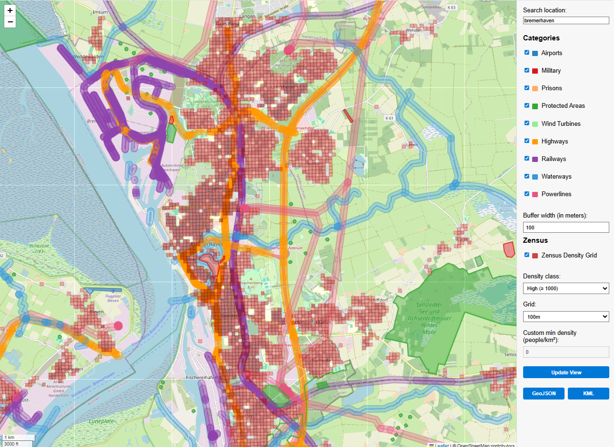

# No-Fly Zone Web App – Quick User Guide

This interactive web application helps you visualize and export potential drone no-fly zones using OpenStreetMap data.

---

## 🚀 Getting Started

1. Open the application in your browser: `http://localhost:8000`
2. Use the **category checkboxes** on the right to show or hide types of restricted areas:
   - Airports
   - Military zones
   - Prisons
   - Protected areas
   - Wind Turbines
   - Roads (Highways)
   - Railways
   - Waterways
   - Powerlines

3. Use the **Search Location** field to jump to any place by typing a city or address and pressing **Enter**.

4. Adjust the **buffer width** (in meters) for:
   - Roads
   - Railways
   - Waterways
   - Powerlines

   The default buffer width is **100 meters**, but you can customize it.

## 🌬️ Wind Turbines

- When you select **"Windturbines"** in the sidebar, all wind turbines from OpenStreetMap will be displayed.
- Each wind turbine is shown as a marker and automatically surrounded by a **50 m no-fly zone buffer circle**.
- These circles are visible on the map and included in both **GeoJSON** and **KML** exports.
- The buffer around wind turbines is fixed at 50 meters and does not depend on the adjustable buffer width setting.

---

## 💾 Export Data

- Use the **GeoJSON** or **KML** buttons to download the currently visible and selected zones.
- Exported data exactly matches what is shown on the map (including buffered polygons for linear features).

---

## 🖼 Interface Preview

---

## ⏳ Loading Overlay

- When loading new data, a **loading screen** appears.
- It disappears automatically when the update is complete.

---

## ℹ️ Notes

- Buffering is only applied to linear features (roads, railways, waterways, powerlines).
- Map updates are limited to areas smaller than **200 km** in width.
- Always verify drone restrictions with **official local aviation authorities**.
- This tool provides **unofficial information** and no liability is assumed.