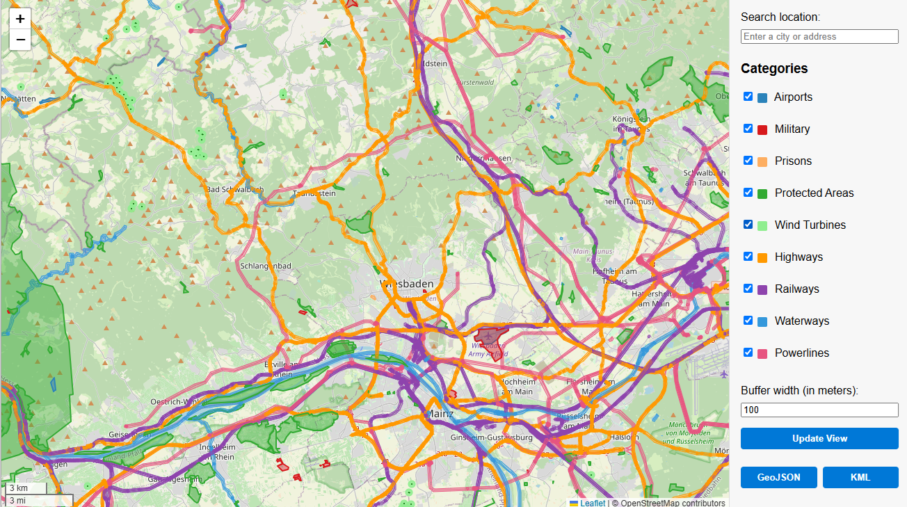

# No-Fly Zone Web App – Quick User Guide

This interactive web application helps you visualize and export potential drone no-fly zones using OpenStreetMap data.

---

## 🚀 Getting Started

1. Open the application in your browser: `http://localhost:8000`
2. Use the **category checkboxes** on the right to show/hide types of restricted areas:
   - Airports
   - Military zones
   - Prisons
   - Protected areas
   - Roads, Railways, Waterways (with buffer distance)

3. Use the **Search Location** field to jump to any place by name (e.g. `Berlin` or `Tokyo`).
4. Adjust the **buffer width** (in meters) for roads, railways, and waterways.

---

## 💾 Export Data

- Use the **GeoJSON** or **KML** buttons to download the currently visible and selected zones.
- Exported zones match exactly what is shown on the map (with buffer polygons).

---

## 🖼 Interface Preview

---

## ℹ️ Notes

- Buffering is applied only to roads, railways, and waterways.
- Map updates are limited to areas smaller than 200 km in width.
- Always verify with official local authorities for legal restrictions.
